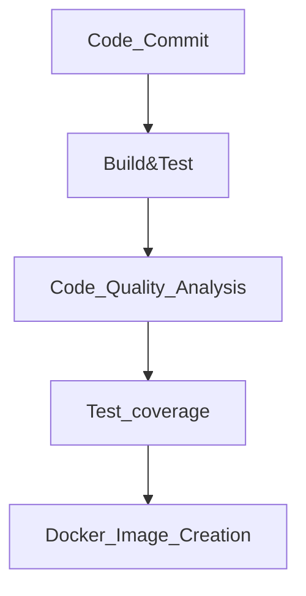

# Practice spring boot project

Using this project for learning and hands-on

# ***CI/CD & Code Quality Automation Platform***
## Project Overview
```
  1.This project demonstrates a production-style CI/CD pipeline for a Spring Boot application, integrating code quality analysis,
    automated testing, and containerization.
  2.The pipeline ensures that only high-quality, tested, and container-ready builds are promoted.
  3.The application is built using Spring Boot and analyzed using SonarCloud, with CI automation handled by Jenkins and deployment
    supported through Docker and Docker Compose.
```
## Architecture Overview

- **Spring Boot Application** – Backend REST API
- **Jenkins** – CI pipeline for build, test, and analysis
- **SonarCloud** – Static code analysis & quality gates
- **Docker** – Containerization of the application
- **Docker Compose** – Multi-container orchestration
- **MySQL** – Relational database
- **GitHub** – Source code management

## Tech Stack

- **Language**: Java 17  
- **Framework** : Spring Boot, Spring Data JPA, Hibernate  
- **Build Tool**: Maven
- **CI/CD** : Jenkins
- **Code Quality** : SonarCloud
- **Testing** : JUnit 5, Mockito
- **Containerization** : Docker, Docker Compose
- **Database** : MySQL
- **Version Control** : Git, GitHub

## CI/CD Pipeline Flow


*`1.Code Commit`* -> Developer pushes code to GitHub.

*`2.Build & Test`* -> Jenkins checkouts the codde and triggers a Maven build and runs unit tests.

*`3.Code Quality Analysis`* -> SonarQube analyzes code for:Bugs,Code smells,Vulnerabilities

*`4.Test coverage`* -> Quality Gates enforce minimum standards.

*`5.Docker Image Creation`* -> The Spring Boot application is packaged and containerized using a Dockerfile.

*`6.Container Orchestration(optional)`* -> Docker Compose manages application and database containers.

## SonarQube Integration
```
   1. Automated static analysis during CI builds
   2. Enforced quality gates for: Code coverage, Maintainability, Reliability, Security
   3. Prevents low-quality code from progressing in the pipeline
```

## Docker Setup

   **Build Docker Image**: `docker build -t store-app .`
    
   **Run Using Docker Compose**: `docker-compose up -d`
    
   **Stop Containers** : `docker-compose down`
   
## Testing Strategy

   **Unit Tests**: Written using JUnit and Mockito to validate business logic and controller behavior.
   
   **Code Coverage**: Enforced via SonarQube quality gates to maintain high test standards.
    
